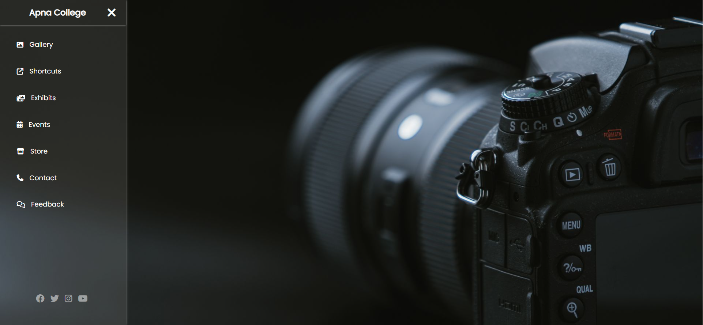

# 🌟 CSS Sidebar Slide

This project features a sleek, glassy-themed sidebar that slides in when you click the three-line menu icon. It's a great example of using HTML and CSS to create an interactive user interface!

## 🌈 Project Overview

The sidebar includes a logo, navigation links, and social media icons. It demonstrates how to create a visually appealing sidebar that enhances user experience.

### 🔗 Live Demo
[View Live Demo](https://omkar-hundre.github.io/CSS-Slider/)

## 📁 Getting Started

To use this project, simply download all the files and open the HTML file in your favorite web browser. 

1. Clone the repository or download the ZIP file.
2. Open the `index.html` file in your browser.

## 💻 Technologies Used

- **HTML5**
- **CSS3**
- **Font Awesome** for icons

## 📸 Screenshots

  

## 📝 Features

- Responsive design
- Smooth transition animations
- Easy navigation with a stylish sidebar

## 🙏 Acknowledgements

A special thanks to **Shraddha Didi** for teaching me HTML and CSS!

## 🔗 Connect with Me

- **GitHub:** [https://github.com/Omkar-Hundre](https://github.com/Omkar-Hundre)
- **LinkedIn:** [https://www.linkedin.com/in/hundreomkar/](https://www.linkedin.com/in/hundreomkar/)

Feel free to explore the project and provide feedback! Your contributions are welcome!
